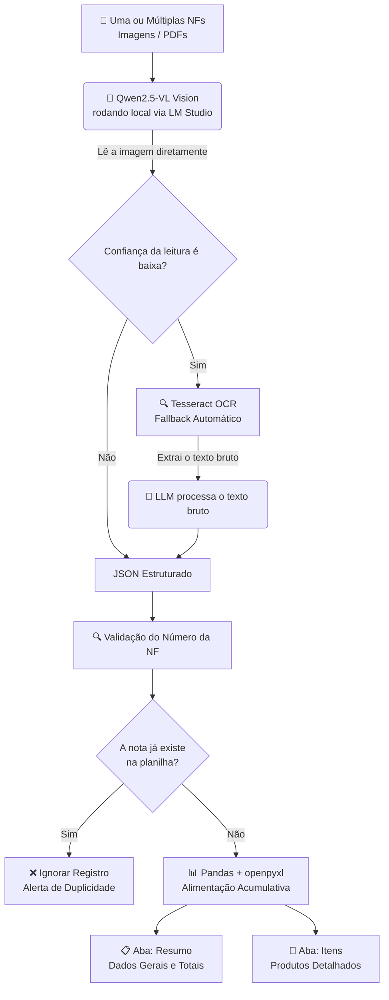

# 🧾 AI Fiscal Assistant

> Assistente financeiro com IA que realiza a leitura automática de notas fiscais e organiza todas as informações em planilhas Excel avançadas. 

O projeto é desenvolvido em etapas progressivas, cada uma construindo sobre a anterior, com o objetivo de demonstrar a aplicação prática de técnicas avançadas de Engenharia de IA e Automação de Dados em um problema corporativo real.

## 🚀 Etapas do Projeto

| # | Etapa | Status | Descrição |
|---|---|:---:|---|
| 1 | `step1_ocr/` | ✅ Concluída | Extração de dados via OCR |
| 2 | `step2_llm/` | ✅ Concluída | Processamento Vision + Tesseract com LLM local |
| 3 | `step3_spreadsheet/` | ✅ Concluída | Gravação acumulativa e inteligente em planilha Excel |
| 4 | `step4_interface/` | 🔜 Em breve | Interface de upload e chat |
| 5 | `step5_dashboard/` | 🔜 Em breve | Dashboard financeiro e analytics |

---

## 🏗️ Arquitetura Atual (Pipeline de Processamento)

O pipeline foi desenhado para processar múltiplos arquivos em lote, garantindo a integridade dos dados através de travas anti-duplicidade e estruturando a saída em um modelo relacional dentro do Excel (Abas separadas para Resumo e Itens).

## 🛠️ Stack Tecnológico

| Camada | Tecnologia Utilizada |
|---|---|
| **OCR (Fallback)** | `pdfplumber`, `pytesseract`, `opencv-python`, `pdf2image` |
| **Vision + LLM** | Qwen2.5-VL-3B-Instruct (via LM Studio) |
| **Comunicação** | `requests` (API compatível OpenAI) |
| **Planilha** | `pandas`, `openpyxl` |
| **Interface** | Streamlit *(em breve)* |
| **Linguagem** | Python 3.11+ |

# ⚙️ Como Rodar Localmente

Pré-requisitos: Python 3.11+, Git, e LM Studio com o modelo Qwen2.5-VL-3B-Instruct instalado.

1. Clone o repositório
git clone [https://github.com/leandrobelo000-afk/ai-fiscal-assistant.git](https://github.com/leandrobelo000-afk/ai-fiscal-assistant.git)
cd ai-fiscal-assistant

2. Crie e ative o ambiente virtual
python -m venv venv
venv\Scripts\activate      # Windows
source venv/bin/activate   # Mac/Linux

3. Instale as dependências
pip install -r requirements.txt

4. Inicie o servidor local do LM Studio
lms server start

5. Rode o processamento completo (Etapa 3)
python step3_spreadsheet/writer.py

💡 Dica: Ao rodar o writer.py, pedirá para abrir ou salvar o arquivo xlsx (planilha), após isto uma janela de seleção de arquivo será aberta automaticamente. Basta selecionar um PDF ou imagem de nota fiscal para testar o processamento.

# 🔍 Detalhamento das Etapas

📋 Etapa 1 — Extração OCR
Detecta automaticamente se o arquivo de entrada é um PDF nativo ou uma imagem escaneada, aplicando o pré-processamento adequado (escala de cinza, binarização, remoção de ruído) antes de executar o OCR. O sistema retorna um objeto com um confidence_score calculado para cada campo.

🤖 Etapa 2 — Processamento com LLM Local
Utiliza o modelo local Qwen2.5-VL-3B-Instruct, aproveitando sua capacidade Vision para interpretar a imagem da nota fiscal de forma orgânica, dispensando o OCR na maioria dos casos. O Tesseract atua de forma complementar e tolerante a falhas (fallback), sendo acionado automaticamente apenas quando a confiança do modelo é baixa.

📊 Etapa 3 — Gravação em planilha Excel
Grava os dados estruturados em notas_fiscais.xlsx de forma acumulativa — cada nova nota processada adiciona uma linha sem sobrescrever as anteriores.
Funcionalidades:

Seletor visual para escolher onde salvar a planilha
Processamento de múltiplas notas de uma vez
Anti-duplicata por número de NF
Aba Resumo com totais automáticos
Aba Itens com todos os produtos detalhados
Instalação automática das dependências

