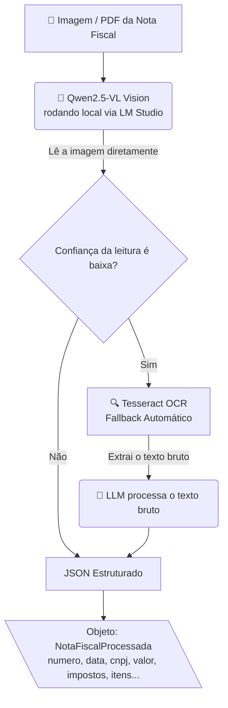

# 🧾 AI Fiscal Assistant

> Assistente financeiro com IA que realiza a leitura automática de notas fiscais e organiza todas as informações em planilhas. 

O projeto é desenvolvido em etapas progressivas, cada uma construindo sobre a anterior, com o objetivo de demonstrar a aplicação prática de técnicas de Engenharia de IA e Automação de Dados em um problema corporativo real.

## 🚀 Etapas do Projeto

| # | Etapa | Status | Descrição |
|---|---|:---:|---|
| 1 | `step1_ocr/` | ✅ Concluída | Extração de dados via OCR |
| 2 | `step2_llm/` | ✅ Concluída | Processamento Vision + Tesseract com LLM local |
| 3 | `step3_spreadsheet/` | 🔜 Em breve | Gravação automática em planilha |
| 4 | `step4_interface/` | 🔜 Em breve | Interface de upload e chat |
| 5 | `step5_dashboard/` | 🔜 Em breve | Dashboard financeiro e analytics |

---

## 🏗️ Arquitetura Atual (Etapas 1 e 2)

O pipeline de processamento foi desenhado para maximizar a precisão. O modelo de visão atua como processador principal, enquanto o OCR clássico funciona como um *fallback* (plano B) seguro para quando o LLM demonstra baixa confiança na leitura.

#🛠️ Stack

Camada         |   TecnologiaUtilizada                                  
OCR (Fallback) |   pdfplumber, pytesseract, opencv-python, pdf2image    
Vision + LLM   |   Qwen2.5-VL-3B-Instruct (via LM Studio)               
Comunicação    |   requests (API compatível OpenAI)
Planilha       |   openpyxl / Google Sheets API (em breve)
InterfaceS     |   treamlit (em breve)
Linguagem      |   Python 3.11+

#⚙️ Como Rodar Localmente

Pré-requisitos: Python 3.11+, Git, e LM Studio com o modelo Qwen2.5-VL-3B-Instruct instalado.

1. Clone o repositório
git clone [https://github.com/leandrobelo000-afk/ai-fiscal-assistant.git](https://github.com/leandrobelo000-afk/ai-fiscal-assistant.git)
cd ai-fiscal-assistant

2. Crie e ative o ambiente virtual
python -m venv venv
venv\Scripts\activate      # Windows
source venv/bin/activate   # Mac/Linux

3. Instale as dependências
pip install -r requirements.txt

4. Inicie o servidor local do LM Studio
lms server start

5. Rode o processamento completo (Etapas 1 + 2)
python step2_llm/processor.py

💡 Dica: Ao rodar o processor.py, uma janela de seleção de arquivo será aberta automaticamente. Basta selecionar um PDF ou imagem de nota fiscal para testar o processamento.

#🔍 Detalhamento das Etapas

📋 Etapa 1 — Extração OCR
Detecta automaticamente se o arquivo de entrada é um PDF nativo ou uma imagem escaneada, aplicando o pré-processamento adequado (escala de cinza, binarização, remoção de ruído) antes de executar o OCR. O sistema retorna um objeto com um confidence_score calculado para cada campo.

🤖 Etapa 2 — Processamento com LLM Local
Utiliza o modelo local Qwen2.5-VL-3B-Instruct, aproveitando sua capacidade Vision para interpretar a imagem da nota fiscal de forma orgânica, dispensando o OCR na maioria dos casos. O Tesseract atua de forma complementar e tolerante a falhas (fallback), sendo acionado automaticamente apenas quando a confiança do modelo é baixa.
